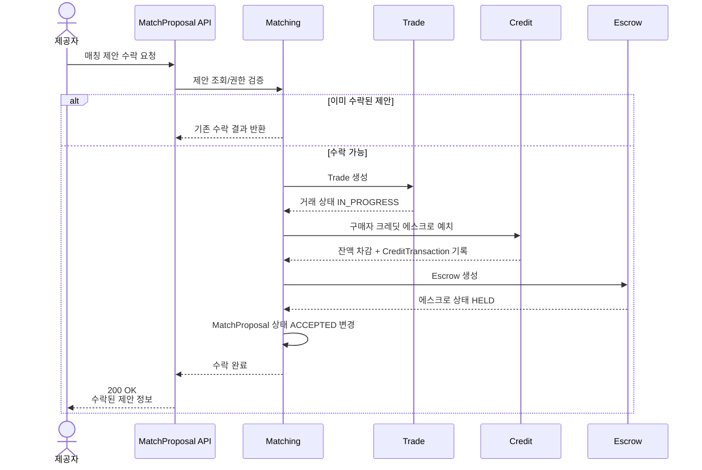
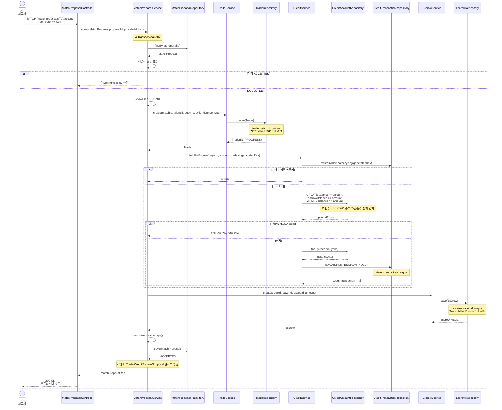
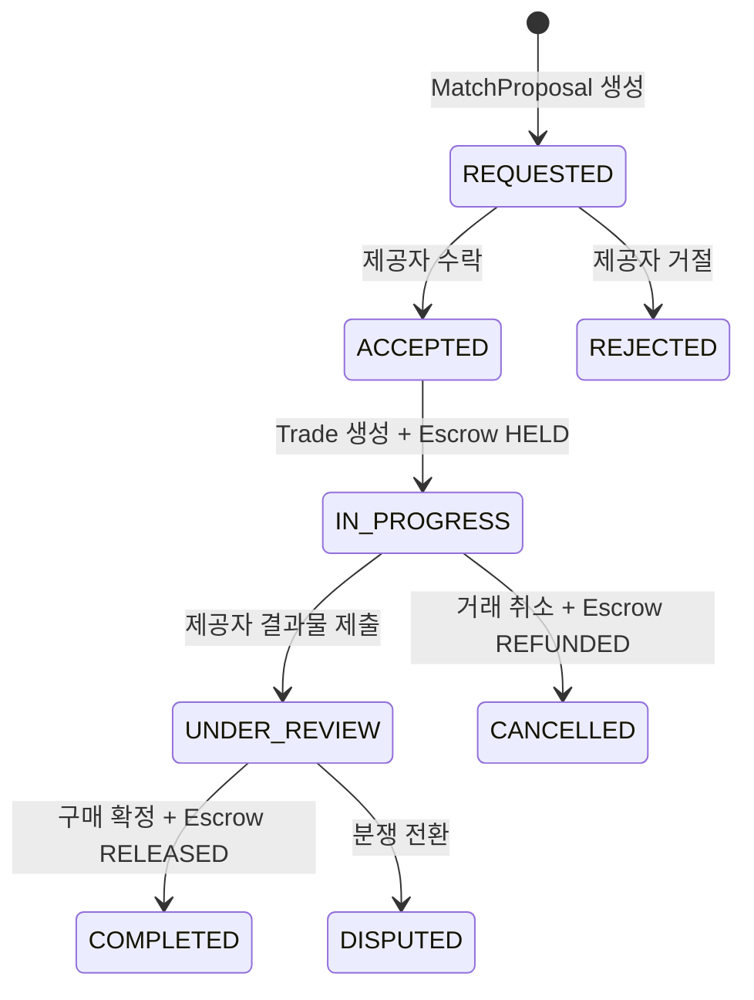

# MatchProposal Accept Flow

기준: 원격 `dev` 코드 기준  
대상 흐름: 매칭 제안 수락 시 `MatchProposal -> Trade -> Credit -> Escrow`가 연결되는 PURCHASE MVP 핵심 흐름

## 1. 요청/응답 요약

### 요청

```http
PATCH /api/v1/match-proposals/{proposalId}/accept
Authorization: Bearer {accessToken}
Idempotency-Key: accept-proposal-1
```

| 값 | 위치 | 설명 |
| --- | --- | --- |
| `proposalId` | Path Variable | 수락할 매칭 제안 ID |
| `Idempotency-Key` | Header | 중복 수락 요청 방지를 위한 클라이언트 멱등키 |
| `providerId` | JWT principal | 요청값으로 직접 받지 않고 `@CurrentUser SecurityUser`에서 추출 |
| Request Body | 없음 | 수락 API는 body를 받지 않음 |

### 응답

성공 시 `SuccessCode.MATCH_PROPOSAL_ACCEPTED`를 사용한다.

```json
{
  "success": true,
  "code": "200-4",
  "message": "매칭 제안이 수락되었습니다.",
  "data": {
    "id": 1,
    "providerTalentId": 10,
    "requesterTalentId": null,
    "requesterId": 1,
    "providerId": 2,
    "status": "ACCEPTED",
    "requestMessage": "해당 재능을 구매하고 싶습니다.",
    "respondedAt": "...",
    "createdAt": "...",
    "updatedAt": "..."
  }
}
```

## 2. 시퀀스 다이어그램: 단순화 흐름



## 3. 시퀀스 다이어그램: 상세 흐름



## 4. 중간 전달 데이터

| 구간 | 전달 데이터 |
| --- | --- |
| Controller -> Matching | `proposalId`, `providerId`, `idempotencyKey` |
| Matching -> Trade | `matchId`, `talentId`, `buyerId`, `sellerId`, `creditPrice`, `tradeType` |
| Matching -> Credit | `buyerId`, `amount`, `tradeId`, `MATCH-PROPOSAL-ACCEPT-{proposalId}:{idempotencyKey}` |
| Credit -> CreditTransaction | `userId`, `relatedTradeId`, `ESCROW_HOLD`, `-amount`, `balanceAfter`, `idempotencyKey` |
| Matching -> Escrow | `tradeId`, `payerId`, `payeeId`, `amount` |
| Controller -> Client | `ApiResponse<MatchProposalRes>` |

## 5. 동시성/락 전략

| 영역 | 현재 전략 | 현재 안전장치 | 보강하면 좋은 점 |
| --- | --- | --- | --- |
| MatchProposal 수락 | `MatchProposalService.acceptMatchProposal()`에 `@Transactional` 적용 | 이미 `ACCEPTED`이면 기존 제안 반환 | `findByIdWithLock()` 추가로 accept/reject 동시 요청 경쟁 방지 |
| Trade 생성 | 같은 트랜잭션 안에서 `TradeService.create()` 호출 | `Trade.matchId` unique 제약 | 중복 생성 예외를 도메인 예외로 변환 |
| Credit 예치 | `CreditService.holdForEscrow()`에서 조건부 update | `balance >= amount`, `CreditTransaction.idempotencyKey` unique | 같은 멱등키가 같은 `userId/tradeId/amount` 요청인지 검증 |
| Escrow 생성 | 같은 수락 흐름에서 `EscrowService.create()` 호출 | `Escrow.tradeId` unique 제약 | 중복 생성 예외를 도메인 예외로 변환 |
| 거래 취소/구매 확정 | `TradeRepository.findByIdWithLock()` 사용 | Trade row pessimistic lock | 취소/확정 외 상태 변경 흐름에도 lock 필요 여부 검토 |
| 결과물 제출 | 현재 일반 조회 후 상태 변경 | `IN_PROGRESS` 상태 검증 | cancel과 submit 동시 요청 경쟁 방지를 위해 lock 적용 검토 |

## 6. 상태 전이



### 상태 의미

| 도메인 | 상태 | 의미 |
| --- | --- | --- |
| MatchProposal | `REQUESTED` | 제공자가 아직 수락/거절하지 않은 제안 |
| MatchProposal | `ACCEPTED` | 제공자가 제안을 수락했고 거래 생성 흐름이 수행됨 |
| MatchProposal | `REJECTED` | 제공자가 제안을 거절함 |
| Trade | `IN_PROGRESS` | 거래 생성 후 제공자가 작업 중 |
| Trade | `UNDER_REVIEW` | 제공자가 결과물을 제출했고 구매자가 검토 중 |
| Trade | `COMPLETED` | 구매 확정 및 정산 완료 |
| Trade | `CANCELLED` | 거래 취소 및 환불 완료 |
| Trade | `DISPUTED` | 분쟁 진행 중 |
| Escrow | `HELD` | 구매자 크레딧이 에스크로에 예치됨 |
| Escrow | `RELEASED` | 구매 확정 후 제공자에게 정산됨 |
| Escrow | `REFUNDED` | 거래 취소로 구매자에게 환불됨 |
| Escrow | `FROZEN` | 분쟁으로 지급이 보류됨 |

## 7. 책임 경계

| 도메인 | 책임 | 직접 가지면 안 되는 책임 |
| --- | --- | --- |
| Matching | 제안 생성/수락/거절, 제안 참여자 검증, 수락 흐름 오케스트레이션 | 크레딧 잔액 변경 세부 로직 |
| Trade | 거래 생성, 거래 상태 전이, 거래 참여자 검증 | CreditTransaction 직접 생성 |
| Escrow | 에스크로 생성, `HELD/RELEASED/REFUNDED` 상태 관리 | 구매자/판매자 잔액 직접 수정 |
| Credit | 잔액/에스크로 잔액 변경, CreditTransaction 기록, 멱등성 처리 | MatchProposal 상태 변경 |

## 8. 현재 코드 기준 판단

- 수락 흐름은 `@Transactional` 안에서 수행되므로 정상 예외 발생 시 전체 롤백 대상이다.
- `CreditService.holdForEscrow()` 내부에서 구매자 잔액 차감, 에스크로 잔액 증가, `ESCROW_HOLD` 거래 내역 기록이 함께 수행된다.
- Trade 중복 생성은 `Trade.matchId` unique 제약으로 방어한다.
- Escrow 중복 생성은 `Escrow.tradeId` unique 제약으로 방어한다.
- CreditTransaction 중복 기록은 `idempotencyKey` unique 제약으로 방어한다.
- 추가 보강 후보는 MatchProposal accept/reject 동시 요청에 대한 lock 전략과 멱등키 재사용 시 요청 동일성 검증이다.
