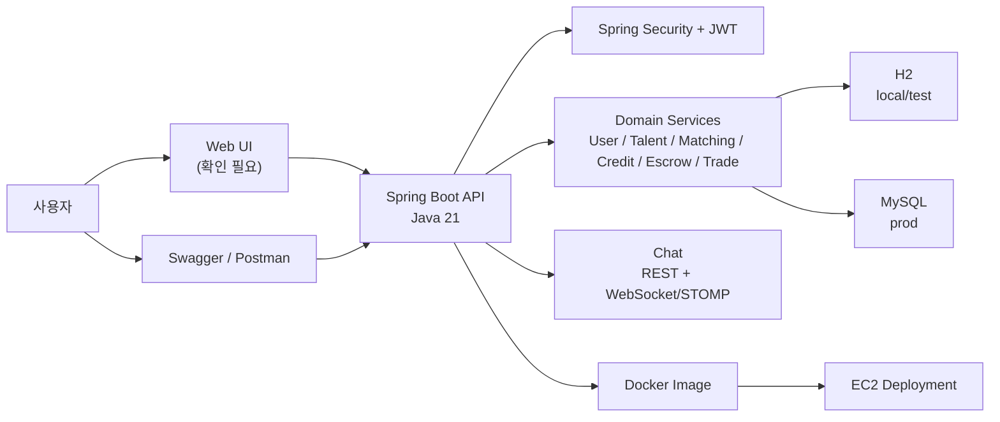
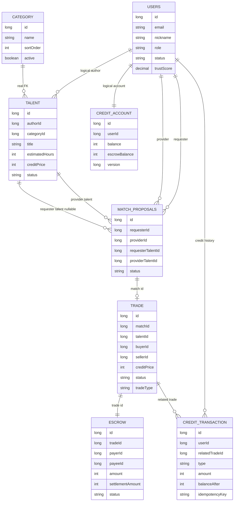
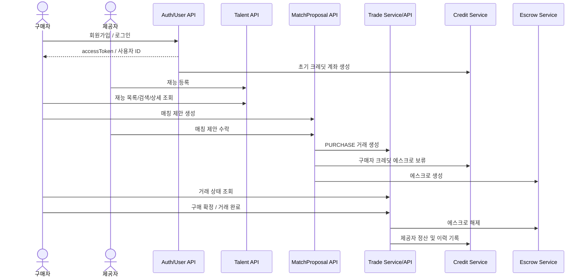
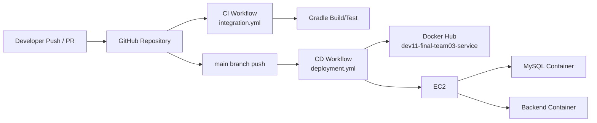

# Baton 시스템 구성도

> 문서 버전: v1.3
> 기준일: 2026-06-23
> 기준 브랜치: `dev`
> 기준 PR: `#62`, `#63`, `#64`, `#67`, `#68` 반영 기준
> 문서 상태: MVP 수동 API 테스트 결과와 채팅 구현 상태 반영
> 목적: 최종 보고서와 발표자료에 사용할 시스템/도메인/시연 흐름 구성도 정리

## 변경 이력

| 버전 | 날짜 | 변경 내용 | 상태 |
| --- | --- | --- | --- |
| v1.0 | 2026-06-20 | 최초 시스템 구성도 작성 | 작성 완료 |
| v1.1 | 2026-06-22 | 문서 버전/기준 브랜치/문서 상태 추가 | 구현 반영 필요 |
| v1.2 | 2026-06-22 | 매칭 수락 후 Trade/Credit/Escrow 연결, Trade 제출/확정 API, CurrentUser 기준 반영 | 최신 구현 기준 요약 |
| v1.3 | 2026-06-23 | 회원가입 초기 크레딧, CreditTransaction 조회 API, Security 인증 정책, 재조회 상태 이슈 반영 | 최신 테스트 기준 |
| v1.4 | 2026-06-23 | 채팅 REST/WebSocket 구현 상태와 MVP 이후 P1 범위 반영 | 최신 총괄 기준 |

## 1. 문서/발표 판단

발표에서는 기술 구성을 한 번에 모두 설명하지 않는다. 먼저 사용자가 보는 흐름을 보여준 뒤, 그 뒤에서 Spring Boot API, 도메인 서비스, DB, CI/CD가 어떻게 받쳐주는지 설명한다.

## 2. 전체 시스템 구성

## 3. 주요 도메인 관계

## 4. PURCHASE MVP 흐름

주의: 위 흐름은 발표 목표 기준의 MVP 완성 흐름이다. 현재 코드 기준으로 회원가입 후 초기 크레딧 지급은 `AuthService.signup()`에서 `CreditService.initializeAccount()`로 연결되어 있고, 매칭 수락 이후 Trade 생성, Credit 에스크로 보류, Escrow 생성은 `MatchProposalService.acceptMatchProposal`에 연결되어 있다. 2026-06-23 수동 테스트에서 구매 확정 후 상세 재조회 상태 저장 이슈가 관측되었으나, `CreditAccountRepository` 벌크 업데이트 flush 설정 수정 후 통합 테스트에서 `COMPLETED/RELEASED` 저장을 확인했다. 발표 전에는 실행 서버 재기동 후 Swagger/Postman으로 재검증한다.

## 5. API 그룹

| API 그룹 | 주요 Endpoint | 발표 포지션 |
|---|---|---|
| Auth/User | `POST /api/v1/auth/signup`, `POST /api/v1/auth/login`, `POST /api/v1/auth/reissue` | 사용자 진입 |
| Talent | `POST /api/v1/talents`, `GET /api/v1/talents`, `GET /api/v1/talents/search`, `GET /api/v1/talents/{id}` | 재능 등록/탐색 |
| Matching | `GET /api/v1/match-recommendations`, `POST /api/v1/match-proposals`, `PATCH /accept`, `PATCH /reject` | 매칭 제안 |
| Credit | `GET /api/v1/credit/balance`, `GET /api/v1/credit/transactions` | 잔액/크레딧 이력 확인 |
| Trade | `GET /api/v1/trade/{tradeId}`, `PATCH /cancel`, `POST /submission`, `GET /submission`, `PATCH /confirm` | 거래 상태/결과물/구매 확정 |
| Talent Attachment | `POST /attachments/presigned-url`, `POST /attachments`, `GET /attachments`, `DELETE /attachments/{attachmentId}` | S3 첨부파일 고도화 |
| Chat | `POST /api/v1/chat-rooms`, `POST /messages`, `GET /messages`, STOMP `/app/chat-rooms/{id}/messages`, `/read` | 채팅 기본 구현 완료, 거래 연결/Redis PubSub는 고도화 |

## 6. CI/CD 구성

## 7. 배포 구성

| 구성 | 내용 | 상태 |
|---|---|---|
| Dockerfile | Java 21 JRE 기반, 빌드된 JAR를 `app.jar`로 실행 | 확인 |
| compose-prod | MySQL + backend 컨테이너 구성 | 확인 |
| Docker Hub image | `ujin3261/dev11-final-team03-service:latest` | 설정 확인 |
| EC2 배포 | SSH 접속 후 Docker Compose로 backend 갱신 | workflow 확인 |
| 최종 URL | 확인 필요 | 비어 있음 |

## 8. 발표 리스크

| 리스크 | 대응 |
|---|---|
| 구매 확정 후 거래 재조회 상태 저장 이슈 | 코드 수정 및 통합 테스트 완료. 발표 전 실행 서버 재기동 후 `confirm` 응답과 `trade detail` 조회 결과가 모두 `COMPLETED/RELEASED`인지 재검증 |
| 실제 배포 URL 미확인 | 발표 전 Swagger/health/API 호출 성공 화면 확보 |
| 재능 조회 인증 정책 혼선 | Security 정책상 Bearer Token 필요 기준으로 Swagger/API 문서 통일 |
| 배포 환경과 로컬 테스트 차이 | 실행 서버가 최신 dev 기준인지 확인하고 테스트 데이터 재생성 |

## 9. 다음 작성 항목

1. 실행 서버 기준 구매 확정 후 거래 재조회 API 재검증 결과 반영
2. 배포 URL과 Swagger URL 입력
3. UI 구조가 확정되면 UI -> API 흐름 추가
4. 최종 테스트/커버리지 수치 입력
