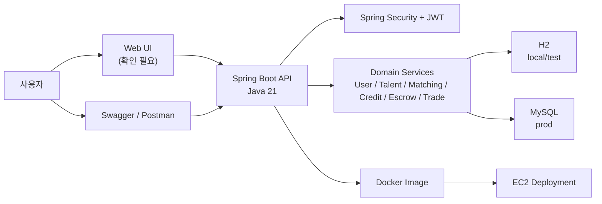
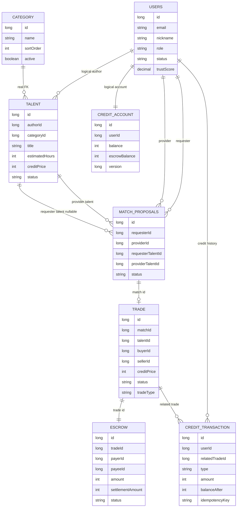
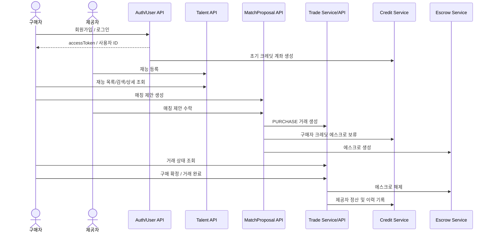
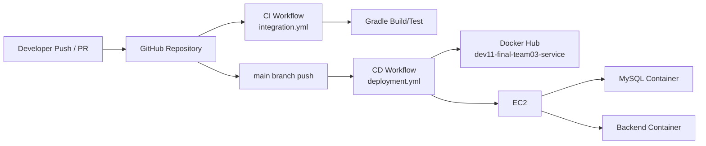

# Baton 시스템 구성도

> 문서 버전: v1.2  
> 기준일: 2026-06-22  
> 기준 브랜치: `refactor/BATON-88-current-user`  
> 기준 PR: `#63` 참고  
> 문서 상태: 최신 구현 기준 요약  
> 목적: 최종 보고서와 발표자료에 사용할 시스템/도메인/시연 흐름 구성도 정리

## 변경 이력

| 버전 | 날짜 | 변경 내용 | 상태 |
| --- | --- | --- | --- |
| v1.0 | 2026-06-20 | 최초 시스템 구성도 작성 | 작성 완료 |
| v1.1 | 2026-06-22 | 문서 버전/기준 브랜치/문서 상태 추가 | 구현 반영 필요 |
| v1.2 | 2026-06-22 | 매칭 수락 후 Trade/Credit/Escrow 연결, Trade 제출/확정 API, CurrentUser 기준 반영 | 최신 구현 기준 요약 |

## 1. 문서/발표 판단

발표에서는 기술 구성을 한 번에 모두 설명하지 않는다. 먼저 사용자가 보는 흐름을 보여준 뒤, 그 뒤에서 Spring Boot API, 도메인 서비스, DB, CI/CD가 어떻게 받쳐주는지 설명한다.

## 2. 전체 시스템 구성

## 3. 주요 도메인 관계

## 4. PURCHASE MVP 흐름

주의: 위 흐름은 발표 목표 기준의 MVP 완성 흐름이다. 현재 코드 기준으로 매칭 수락 이후 Trade 생성, Credit 에스크로 보류, Escrow 생성은 `MatchProposalService.acceptMatchProposal`에 연결되어 있다. 다만 회원가입 직후 초기 크레딧 자동 지급은 `AuthService.signup()`에 아직 연결되지 않은 P0 잔여 작업이다.

## 5. API 그룹

| API 그룹 | 주요 Endpoint | 발표 포지션 |
|---|---|---|
| Auth/User | `POST /api/v1/auth/signup`, `POST /api/v1/auth/login`, `POST /api/v1/auth/reissue` | 사용자 진입 |
| Talent | `POST /api/v1/talents`, `GET /api/v1/talents`, `GET /api/v1/talents/search`, `GET /api/v1/talents/{id}` | 재능 등록/탐색 |
| Matching | `GET /api/v1/match-recommendations`, `POST /api/v1/match-proposals`, `PATCH /accept`, `PATCH /reject` | 매칭 제안 |
| Credit | `GET /api/v1/credit/balance` | 잔액 확인 |
| Trade | `GET /api/v1/trade/{tradeId}`, `PATCH /cancel`, `POST /submission`, `GET /submission`, `PATCH /confirm` | 거래 상태/결과물/구매 확정 |
| Talent Attachment | `POST /attachments/presigned-url`, `POST /attachments`, `GET /attachments`, `DELETE /attachments/{attachmentId}` | S3 첨부파일 고도화 |
| Chat | `POST /api/v1/chat-rooms`, `POST /messages`, `GET /messages` | 채팅 고도화 |

## 6. CI/CD 구성

## 7. 배포 구성

| 구성 | 내용 | 상태 |
|---|---|---|
| Dockerfile | Java 21 JRE 기반, 빌드된 JAR를 `app.jar`로 실행 | 확인 |
| compose-prod | MySQL + backend 컨테이너 구성 | 확인 |
| Docker Hub image | `ujin3261/dev11-final-team03-service:latest` | 설정 확인 |
| EC2 배포 | SSH 접속 후 Docker Compose로 backend 갱신 | workflow 확인 |
| 최종 URL | 확인 필요 | 비어 있음 |

## 8. 발표 리스크

| 리스크 | 대응 |
|---|---|
| 회원가입 후 초기 크레딧 자동 지급이 끊겨 있음 | `AuthService.signup()`에서 `CreditService.initializeAccount()` 연결 필요 |
| 실제 배포 URL 미확인 | 발표 전 Swagger/health/API 호출 성공 화면 확보 |
| `SecurityConfig`가 아직 대부분 permitAll | JWT 필터와 `@CurrentUser` 구조는 적용되어 있으나 최종 인가 정책 점검 필요 |
| CreditTransaction 조회 API 부재 | DB 확인 또는 조회 API 추가 여부 결정 |

## 9. 다음 작성 항목

1. 회원가입 후 초기 크레딧 자동 지급 연결 여부 반영
2. 배포 URL과 Swagger URL 입력
3. UI 구조가 확정되면 UI -> API 흐름 추가
4. CreditTransaction 조회 방식 확정
