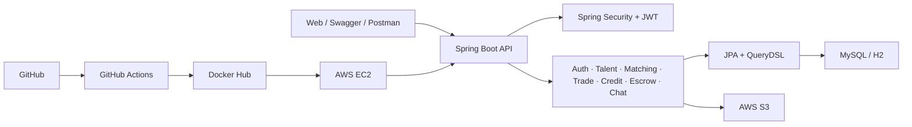
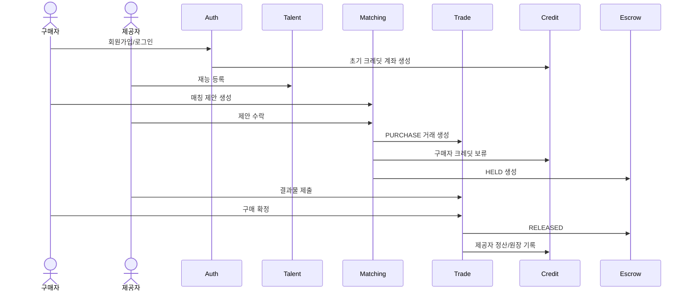
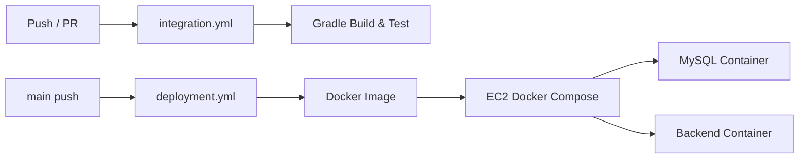

# Baton 시스템 구성도

> 기준일: 2026-07-01

## 1. 전체 구성

## 2. PURCHASE 흐름

## 3. 도메인 책임

| 도메인 | 책임 |
| --- | --- |
| Auth/User | 인증, 토큰, 사용자 상태 |
| Talent | 재능 CRUD, 검색, 첨부파일 |
| Matching | 추천, 제안, 수락/거절 |
| Trade | 거래 상태, 결과물, 구매 확정/취소 |
| Credit | 잔액, 에스크로 잔액, 거래 원장 |
| Escrow | 보류, 해제, 환불 상태 |
| Chat | 채팅방, 메시지, WebSocket/STOMP |

## 4. CI/CD

| 구성 | 상태 |
| --- | --- |
| CI workflow | 구현 완료, 최종 성공 로그 캡처 필요 |
| 최신 DEV CI | `bc39d192`, 성공 |
| 실제 배포 CD | main `4f18382`, 성공 |
| Docker/Compose | 구현 완료 |
| EC2 API | `http://54.116.23.255`, HTTP 200 확인 |
| Swagger | `http://54.116.23.255/swagger-ui/index.html`, HTTP 200 확인 |
| OpenAPI | `http://54.116.23.255/v3/api-docs`, HTTP 200 확인 |

최신 DEV의 CD는 백엔드 이미지 갱신 시 `docker compose down`을 제거하고 전체 Compose 서비스를 `up -d`하여 프론트 컨테이너가 함께 종료되는 문제를 방지한다. SMTP 운영 환경 변수, 재능 목록 조회, 거래 취소 정책 보완도 DEV에 포함됐지만 PR #122 병합 전이므로 main 배포 SHA에는 아직 포함되지 않았다.

## 5. 성능 검증

k6를 사용해 배포 서버의 read, login, PURCHASE smoke 시나리오를 검증했다. 총 1,323개 요청에서 HTTP 실패율은 0%였으며 모든 설정 임계치를 통과했다. 서버 CPU, 메모리, DB connection과 Grafana 화면은 별도 확보가 필요하다.
